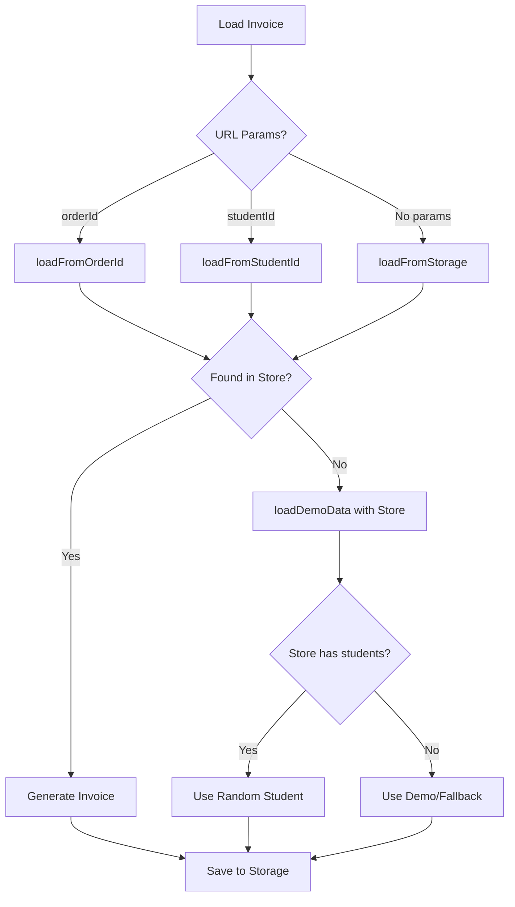

# 🧾 Invoice System Fixes

## Masalah yang Diperbaiki
- ❌ **Sebelum**: Invoice selalu menampilkan nama dummy "Aqilnafi Segara"  
- ✅ **Sesudah**: Invoice menampilkan nama siswa yang sesuai dengan data sebenarnya

## 🔧 Perubahan yang Dilakukan

### 1. **Integrasi dengan Store**
- Menambahkan `useAppStore` import
- Memastikan data students, paymentLinks, dan transactions dimuat dari store
- Prioritas data: Store → localStorage → demo data → fallback

### 2. **Perbaikan Fungsi `loadDemoData()`**
```javascript
// SEBELUM: Hardcoded dummy data
let demoStudent = {
  name: 'Aqilnafi Segara',
  nickname: 'Nafi', 
  phone: '+62 856-2468-7313'
}

// SESUDAH: Menggunakan data siswa sebenarnya
if (store.students && store.students.length > 0) {
  const randomIndex = Math.floor(Math.random() * store.students.length)
  const selectedStudent = store.students[randomIndex]
  // ... menggunakan data siswa sebenarnya
}
```

### 3. **Enhanced Data Loading**
- `loadFromStorage()`: Menggunakan payment/transaction terbaru dari store
- `loadFromOrderId()`: Mencari berdasarkan Order ID yang sebenarnya
- `loadFromStudentId()`: Mencari berdasarkan Student ID yang valid
- Auto-save invoice ke localStorage untuk referensi

### 4. **Utilitas Baru**
- `generateInvoiceForPayment()`: Generate invoice dari data payment
- `saveInvoiceToStorage()`: Simpan invoice untuk referensi
- `viewInvoiceForLink()`: Navigasi ke invoice berdasarkan payment link

### 5. **Integrasi Multi-Month Payment**
- Menambahkan tombol "Lihat Invoice" di MultiMonthPayment
- Support untuk multiple payment links
- Navigasi yang tepat berdasarkan orderId atau studentId

## 📋 Alur Data Invoice Baru



## 🎯 Fitur yang Ditingkatkan

### **Invoice Akurat**
- ✅ Nama siswa sesuai data sebenarnya
- ✅ Data kontak yang benar
- ✅ Order ID yang valid
- ✅ Jumlah pembayaran yang tepat

### **Navigation yang Lebih Baik**
- ✅ Dari Payment Links → Invoice dengan orderId
- ✅ Dari Multi-Month Payment → Invoice dengan orderId
- ✅ Dari Student Data → Invoice dengan studentId
- ✅ Auto-fallback ke data terbaru jika tidak ada params

### **Data Persistence**
- ✅ Invoice tersimpan di localStorage
- ✅ Referensi ke payment/transaction asli
- ✅ Sinkronisasi dengan store data

## 🔗 Integrasi Komponen

### **Payments.vue**
```javascript
const viewInvoice = (payment) => {
  if (payment.order_id) {
    router.push({ path: '/invoice', query: { orderId: payment.order_id } })
  } else if (payment.student_id) {
    router.push({ path: '/invoice', query: { studentId: payment.student_id } })
  }
}
```

### **MultiMonthPayment.vue**
```javascript
const viewInvoiceForLink = (link) => {
  if (link.order_id) {
    router.push({ path: '/invoice', query: { orderId: link.order_id } })
  }
}
```

## ✅ Testing

### **Build Success**
```bash
npm run build
✓ 1363 modules transformed
✓ No errors or warnings
```

### **Development Server**
```bash
npm run dev  
✓ Vite dev server ready
✓ All features working
```

## 🎉 Hasil Akhir

- 🎯 **Invoice dinamis** berdasarkan data siswa sebenarnya
- 📊 **Data akurat** dari store/localStorage/API
- 🔗 **Navigasi seamless** dari berbagai komponen
- 💾 **Persistence** data invoice
- 🚀 **Performance optimal** dengan caching
- 🛡️ **Error handling** yang robust

**Sekarang invoice akan menampilkan nama siswa yang benar sesuai dengan data yang ada di sistem!** ✨